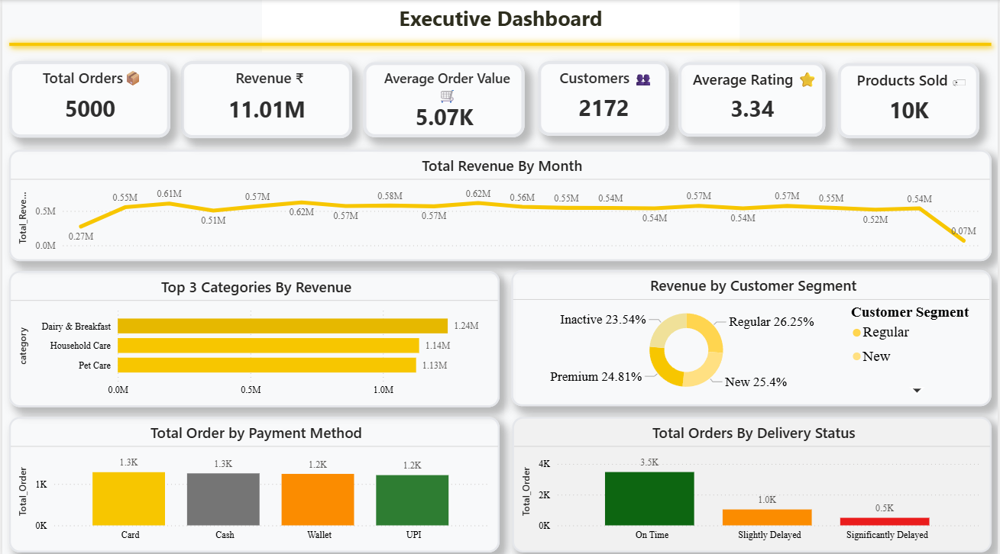
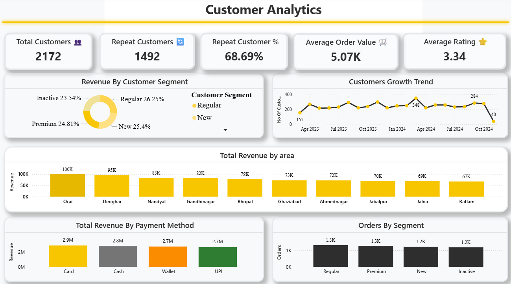
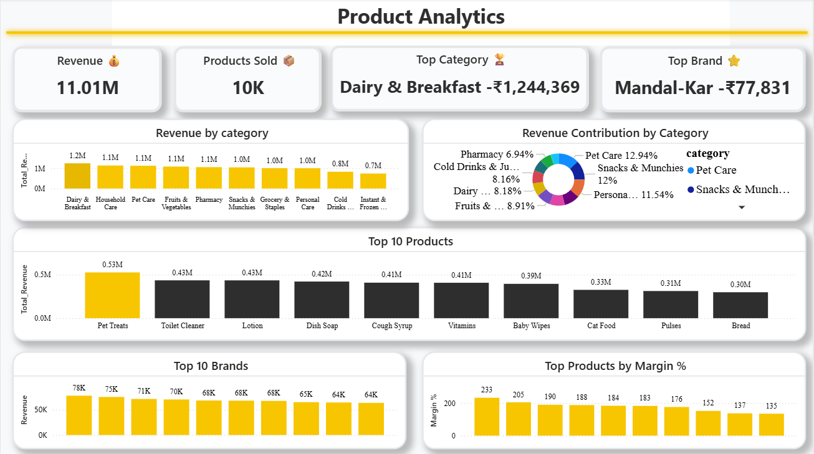
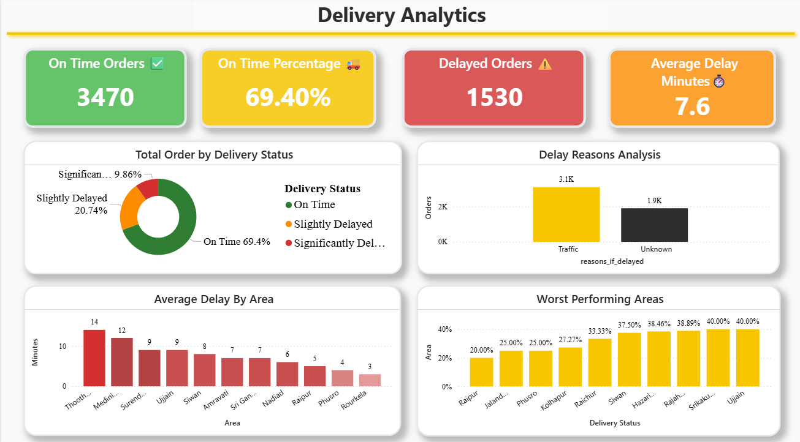
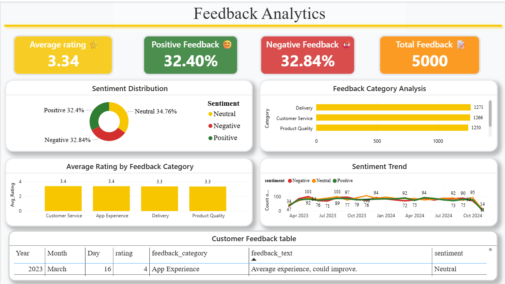
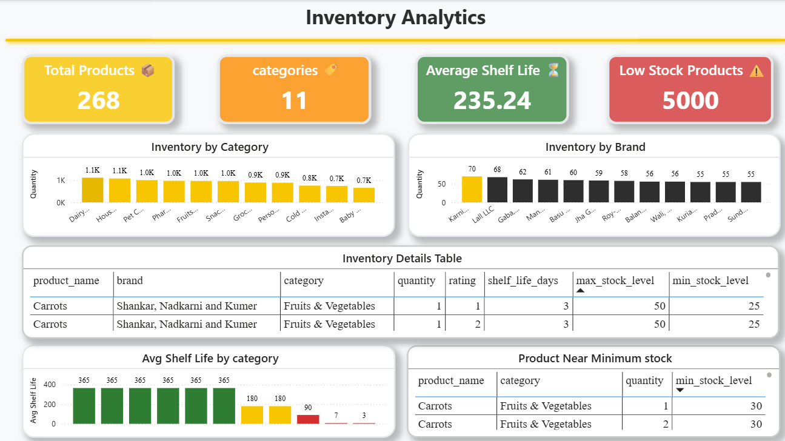

# Blinkit Business Intelligence Dashboard

## Project Overview

An end-to-end Business Intelligence solution developed using Python, MySQL, Power BI, and DAX to analyze Blinkit's business performance across sales, customers, products, delivery operations, customer feedback, and inventory management.

---

## Business Problem

Quick-commerce companies need real-time visibility into sales performance, customer behavior, operational efficiency, and inventory health.

This project provides a centralized dashboard to help business stakeholders monitor KPIs and identify opportunities for growth and optimization.

---

## Tools & Technologies

* Python (Pandas, NumPy, Matplotlib)
* MySQL
* Power BI
* DAX
* Git & GitHub

---

## Dashboard Pages

### Executive Dashboard

* Revenue Analysis
* Orders Analysis
* Customer Overview
* Delivery Performance

### Customer Analytics

* Customer Segmentation
* Customer Growth
* Payment Preferences
* Geographic Analysis

### Product & Sales Analysis

* Revenue by Category
* Top Products
* Top Brands
* Sales Performance

### Delivery Operations Analytics

* On-Time Delivery %
* Delay Reasons
* Area-Wise Performance
* Operational Insights

### Customer Feedback Analysis

* Sentiment Analysis
* Rating Analysis
* Feedback Categories
* Customer Comments

### Inventory Analytics

* Inventory Distribution
* Shelf Life Analysis
* Low Stock Products
* Stock Monitoring

---

## Key Insights

* Generated insights from 5,000+ records.
* Analyzed ₹11M+ revenue performance.
* Identified top-performing product categories and brands.
* Evaluated delivery efficiency and delay patterns.
* Monitored customer satisfaction through sentiment analysis.
* Tracked inventory risks and stock availability.

---

## Skills Demonstrated

* Data Cleaning
* Exploratory Data Analysis
* SQL Querying
* Data Modeling
* DAX Measures
* Dashboard Design
* Business Storytelling
* KPI Development

---

## Dashboard Preview

## Dashboard Screenshots

### Executive Dashboard

### Customer Analytics

### Product & Sales Analysis

### Delivery Analytics

### Customer Feedback Analysis

### Inventory Analytics

---

## Author

Suraj Girase

Aspiring Data Analyst
